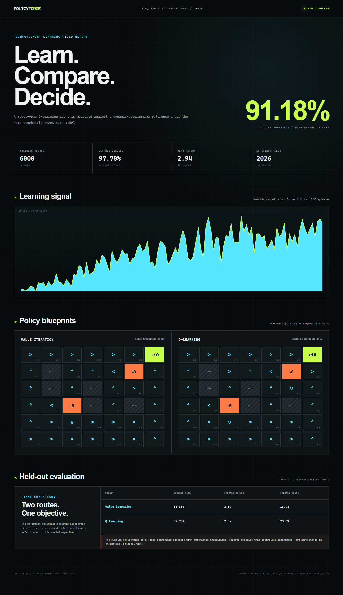
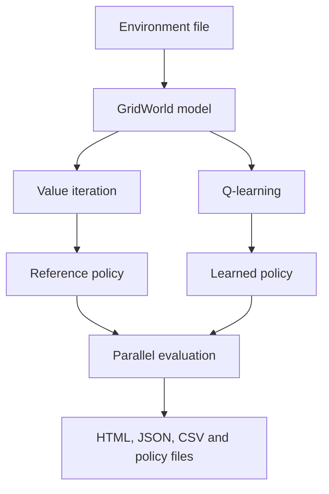

# PolicyForge

PolicyForge is a C++20 reinforcement-learning laboratory for comparing model-based planning with learning from experience. It trains a Q-learning agent in a stochastic campus-navigation environment, computes a value-iteration reference policy, evaluates both policies through parallel Monte Carlo rollouts, and generates a self-contained experiment report.

## Experiment report




## Why this project

The project focuses on the engineering behind trustworthy reinforcement-learning experiments:

- explicit environment and transition models;
- reproducible pseudo-random training;
- a dynamic-programming reference for comparison;
- multithreaded held-out evaluation;
- machine-readable experiment artifacts;
- automated behavioural and numerical tests;
- no runtime libraries beyond the C++ standard library.

## Experiment workflow



## Verified result

The bundled experiment uses seed `2026`, 6,000 training episodes, and 2,000 held-out rollouts per policy.

| Measurement | Value iteration | Q-learning |
|---|---:|---:|
| Positive-terminal rate | 88.30% | 97.70% |
| Mean discounted return | 3.6930 | 2.9429 |
| Mean episode length | 13.98 | 23.09 |

The policies agree on 91.18% of comparable states. Value iteration maximizes expected discounted return and takes a shorter route with greater exposure to a negative terminal. The learned policy is more conservative in this fixed run, producing a higher positive-terminal rate but a lower mean discounted return. The complete result is recorded in [EVALUATION_REPORT.md](EVALUATION_REPORT.md).

## Requirements

- A C++20 compiler: GCC 11+, Clang 14+, or Visual Studio 2022
- GNU Make, CMake, or PowerShell

## Run on Windows

Open PowerShell in the project directory. With `g++` available on your `PATH`:

```powershell
powershell -ExecutionPolicy Bypass -File .\scripts\verify.ps1
powershell -ExecutionPolicy Bypass -File .\scripts\run-demo.ps1
```

The second command builds the program, runs the verified experiment, and opens `runs\demo\report.html`.

## Run on Linux or macOS

```bash
make test
make demo
```

Then open `runs/demo/report.html` in a browser.

## CMake alternative

```bash
cmake -S . -B build
cmake --build build
ctest --test-dir build --output-on-failure
./build/policyforge --environment examples/campus-navigation.env --output runs/demo --workers 4
```

On Windows, the executable may be placed in `build\Debug` or `build\Release`, depending on the selected CMake generator.

## Command-line options

```text
--environment PATH          GridWorld environment file
--output PATH               Experiment output directory
--episodes N                Q-learning training episodes
--evaluation-episodes N     Held-out policy rollouts
--max-steps N               Maximum steps per episode
--workers N                 Parallel evaluation workers
--seed N                    Reproducible random seed
```

Use `build/policyforge --help` to display the same reference in the terminal.

## Environment format

Environments are readable `key=value` files:

```ini
width=5
height=4
start=0,3
step_reward=-0.04
slip_probability=0.10
wall=1,1
terminal=4,0,10
terminal=3,1,-8
```

The intended action occurs with probability `1 - 2 × slip_probability`. The remaining probability is split between the actions immediately to its left and right. A blocked movement leaves the agent in its current state.

## Output files

Each run produces:

```text
runs/demo/
├── report.html          self-contained visual report
├── summary.json         configuration and evaluation metrics
├── training.csv         return and step count for every episode
├── optimal-policy.txt   value-iteration policy
└── learned-policy.txt   Q-learning policy
```

## Repository structure

```text
include/policyforge/    public C++ interfaces
src/                    environment, algorithms, reporting and CLI
tests/                  dependency-free test runner
examples/               reproducible environment definitions
scripts/                Windows verification and demo commands
docs/                   architecture notes and verified artifacts
.github/workflows/      continuous integration
```

## Scope and limitations

- The implementation uses tabular methods and is intended for finite discrete environments.
- The bundled scenario validates implementation behaviour; it is not a benchmark for a physical navigation system.
- Policy agreement can understate similarity when several actions have nearly equal value.
- Results from a single seed should not be treated as a general performance claim.

## License

Released under the [MIT License](LICENSE).
